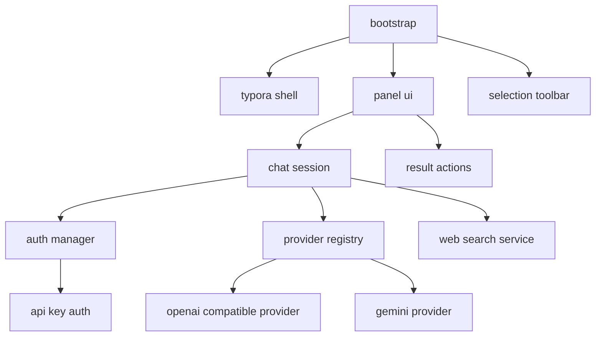

# Architecture

## High-Level Layers

1. Typora Shell
2. UI Layer
3. Application Layer
4. Auth Layer
5. Provider Layer
6. Search Layer

## Layer Responsibilities

### Typora Shell

Owns integration with Typora internals:

- capture selection
- read current document
- restore selection
- replace or insert text
- bind plugin entry points

### UI Layer

Owns all interactive surfaces:

- right-side chat panel
- selection floating toolbar
- result preview card
- settings screen

### Application Layer

Coordinates user-facing actions:

- chat session
- rewrite flow
- document Q&A
- web search flow
- result application

### Auth Layer

Abstracts credentials and login flows:

- API key storage
- auth capability discovery

### Provider Layer

Abstracts model calls behind a common interface:

- streaming completion
- model listing
- capability metadata

### Search Layer

Owns web search adapters and citation assembly.

## Core Boundaries

- UI must not know provider protocol details.
- Providers must not know Typora DOM details.
- Auth must not be coupled to a specific provider widget.
- Result actions must be reusable by chat, rewrite, and search flows.

## Initial Module Graph

## Recommended Runtime Flow

1. User opens panel or selects text.
2. UI requests current context from Typora Shell.
3. Application Layer builds an action request.
4. Auth Layer resolves a usable credential path.
5. Provider Layer streams tokens or returns a completed response.
6. Result Actions expose replace, insert, and copy.
